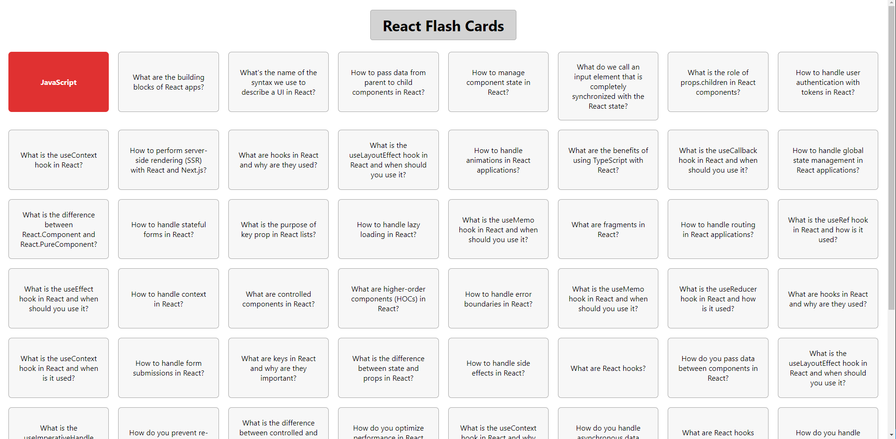
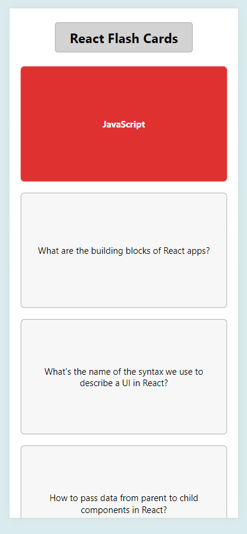

# Flash Cards React

Welcome to Flash Cards React! This project is a simple flashcard application designed to help users learn about React. The app is available for both PC and mobile versions.

## Demo

https://boostertech.github.io/FlashCards/

## Table of Contents

- [Features](#features)
- [Installation](#installation)
- [Usage](#usage)
- [Screenshots](#screenshots)
- [Contributing](#contributing)
- [License](#license)

## Features

- Flashcards for learning React concepts
- Responsive design for PC and mobile
- Simple and intuitive user interface

## Installation

To get a local copy up and running, follow these simple steps:

1. **Clone the repository**

   ```sh
   git clone https://github.com/your-username/flash-cards-react.git
   ```

2. **Navigate to the project directory**

   ```sh
   cd flash-cards-react
   ```

3. **Install dependencies**

   ```sh
   npm install
   ```

4. **Start the application**

   ```sh
   npm start
   ```

   Your app should now be running on [http://localhost:3000](http://localhost:3000).

## Usage

- Open the application in your browser.
- Navigate through the flashcards using the next and previous buttons.
- The app is designed to work seamlessly on both PC and mobile devices.

## Screenshots

### PC Version



### Mobile Version



## Contributing

Contributions are what make the open source community such an amazing place to learn, inspire, and create. Any contributions you make are **greatly appreciated**.

1. Fork the Project
2. Create your Feature Branch (`git checkout -b feature/AmazingFeature`)
3. Commit your Changes (`git commit -m 'Add some AmazingFeature'`)
4. Push to the Branch (`git push origin feature/AmazingFeature`)
5. Open a Pull Request

## License

Distributed under the MIT License. See `LICENSE` for more information.

---

Feel free to modify the README as needed to better suit your project!

************-----------------------------------************

# Getting Started with Create React App

This project was bootstrapped with [Create React App](https://github.com/facebook/create-react-app).

## Available Scripts

In the project directory, you can run:

### <span style="font-size:14px;">`npm start`</span>

<span style="font-size:14px;">Runs the app in the development mode.<br>
Open [http://localhost:3000](http://localhost:3000) to view it in your browser.</span>

<span style="font-size:14px;">The page will reload when you make changes.<br>
You may also see any lint errors in the console.</span>

### <span style="font-size:14px;">`npm test`</span>

<span style="font-size:14px;">Launches the test runner in the interactive watch mode.<br>
See the section about [running tests](https://facebook.github.io/create-react-app/docs/running-tests) for more information.</span>

### <span style="font-size:14px;">`npm run build`</span>

<span style="font-size:14px;">Builds the app for production to the `build` folder.<br>
It correctly bundles React in production mode and optimizes the build for the best performance.</span>

<span style="font-size:14px;">The build is minified and the filenames include the hashes.<br>
Your app is ready to be deployed!</span>

<span style="font-size:14px;">See the section about [deployment](https://facebook.github.io/create-react-app/docs/deployment) for more information.</span>

### <span style="font-size:14px;">`npm run eject`</span>

<span style="font-size:14px;">**Note: this is a one-way operation. Once you `eject`, you can't go back!**</span>

<span style="font-size:14px;">If you aren't satisfied with the build tool and configuration choices, you can `eject` at any time. This command will remove the single build dependency from your project.</span>

<span style="font-size:14px;">Instead, it will copy all the configuration files and the transitive dependencies (webpack, Babel, ESLint, etc) right into your project so you have full control over them. All of the commands except `eject` will still work, but they will point to the copied scripts so you can tweak them. At this point you're on your own.</span>

<span style="font-size:14px;">You don't have to ever use `eject`. The curated feature set is suitable for small and middle deployments, and you shouldn't feel obligated to use this feature. However, we understand that this tool wouldn't be useful if you couldn't customize it when you are ready for it.</span>

## Learn More

<span style="font-size:14px;">You can learn more in the [Create React App documentation](https://facebook.github.io/create-react-app/docs/getting-started).</span>
